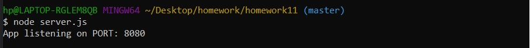
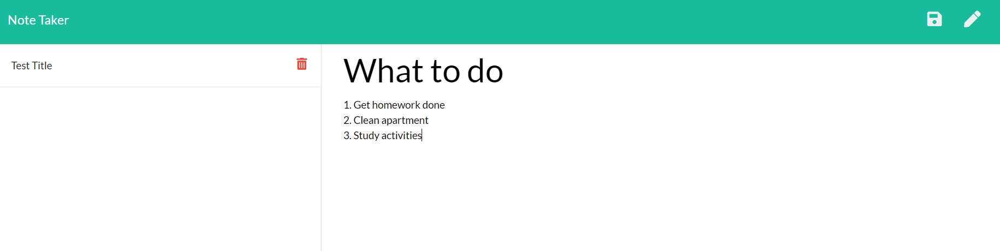
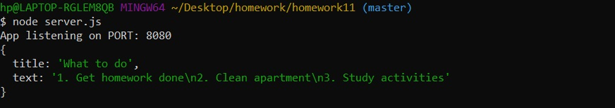
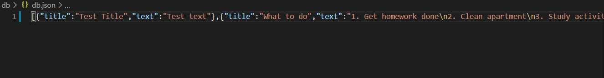
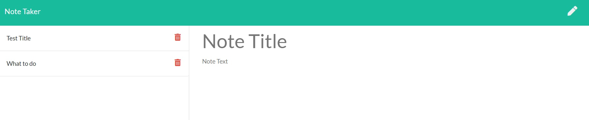
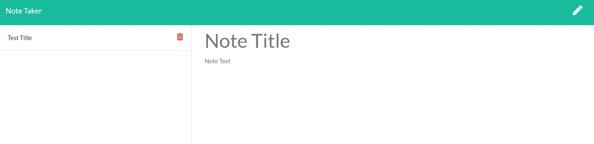

* NoteTaker

<!-- Live link to deployed app -->
Repository: https://github.com/Mdudzik92/homework11
Deployed app:  https://mdudzik92.github.io/homework11/ 

<!-- Technologies used -->
Node.js, JSON, APIs, Express.js

<!-- Explanation of what the app is -->
This is an app which allows the user to take notes on a web browser and save them to a JSON file through the use of Express.js on the back end.

<!-- Screenshot -->
Listening for information added via Port 8080:

The user can fill out a note however they want:

They can then save their information, logging it to db.json:

The user can then delete their not by clicking the trash can button next to the saved note:

<!-- License -->
MIT

<!-- Contact information -->
Email: mdudzik92@gmail.com